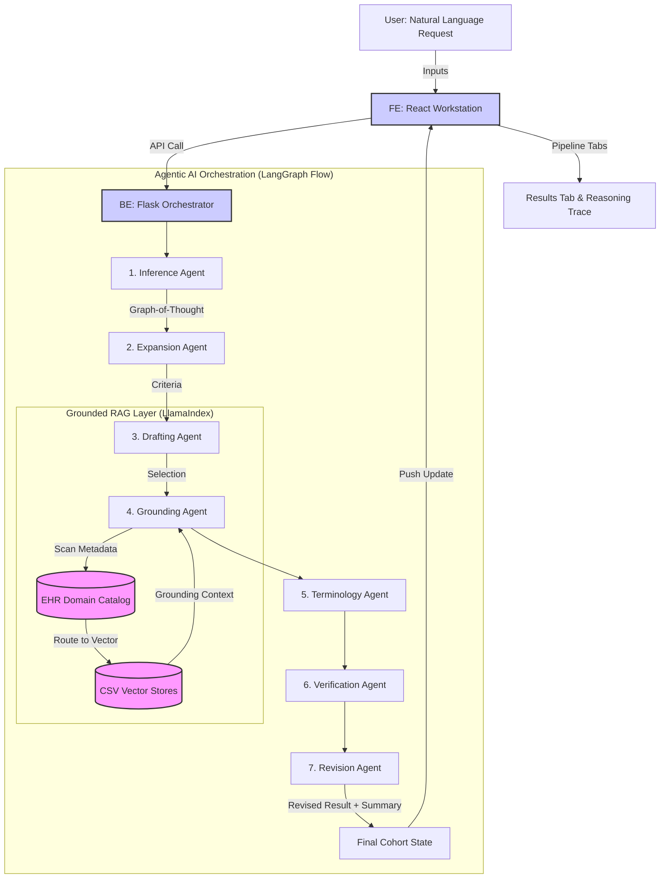

# Architecture Visualization Prompts

This guide provide two distinct ways to "draw" the system architecture: a **Technical Mermaid Diagram** for documentation and a **Creative Visual Prompt** for high-fidelity AI-generated art.

## 1. Technical Mermaid Diagram Prompt
The system is built on an **Agentic AI Orchestration** model using LangGraph and LlamaIndex. Use the following code in a [Mermaid Live Editor](https://mermaid.live/) to generate a technical flowchart.

---

## 2. Creative Visual Prompt (for DALL-E / Midjourney)
If you want to generate a professional, high-fidelity visual illustration of the system architecture, use the prompt below.

**Prompt:**
> "A professional 3D isometric architecture diagram for an AI Cohort Refinement platform. The design is sleek, modern, and clinical. On the left, a glass-morphism dashboard 'User Interface' shows a collapsible sidebar and horizontal progress dots. In the center, a series of glowing translucent 'Agent Nodes' (Inference, Expansion, Grounding, Terminology) are connected by pulsing data streams representing a LangGraph workflow. On the right, a 'Knowledge Base' section shows stacked server blocks labeled LlamaIndex and EHR Catalog, with binary particles being retrieved. The color palette is 'Clinical Tech': Deep navy, vibrant cyan, and neon green accents. Soft lighting, high detail, 8k resolution, flat vector style with depth."

---

## 3. 2D Technical "Blueprint" Prompt (for Imagen / Google Flow)
This prompt focuses on a flat, 2D schematic layout using the actual system components and terminology.

**Prompt:**
> "A flat 2D technical schematic diagram of an AI software architecture. The layout flows from left to right. On the far left is 'React Frontend (Workstation UI)'. A central conduit labeled 'LangGraph Orchestrator' contains a sequence of rectangular blocks: 'Inference Agent (GoT)', 'Expansion Agent', 'Drafting Agent', 'Grounding Agent (ReAct)', 'Terminology Agent', and 'Revision Agent'. Below the agents is a horizontal 'Knowledge Layer' labeled 'LlamaIndex RAG', connected to the 'Grounding Agent' via bidirectional arrows. The Knowledge Layer contains icons representing 'EHR Domain Catalog' and 'CSV Vector Stores'. The aesthetic is a clean engineering blueprint: flat symbols, thin line art, technical sans-serif typography, and a 'Modern Lab' color palette of slate gray, crisp white, and electric blue accents. No 3D, no perspective, high-contrast 2D graphics."

---

## 4. Agent Role Descriptions
Below is the technical breakdown of what each specialized AI agent does within the **LangGraph** orchestration:

1. **Inference Agent (Inference Control)**
   - **Reasoning**: Graph-of-Thought (GoT).
   - **Role**: Analyzes the raw natural language input to determine the core study design and target clinical population. It establishes the high-level roadmap for the refinement.

2. **Expansion Agent (Domain Targeting)**
   - **Role**: Scans the **EHR Domain Catalog** to identify which data silos (CSVs) are relevant to the cohort. It expands simple requests into a comprehensive list of clinical dimensions to be explored.

3. **Drafting Agent (Structural Blueprinting)**
   - **Role**: Translates clinical requirements into a formal, structured JSON cohort definition (Initial Draft). It sets the baseline logic for inclusion, exclusion, and index event criteria.

4. **Refinement Agent (Grounded RAG)**
   - **Reasoning**: ReAct (Reason+Act) Loop.
   - **Role**: The core grounding engine. It iterates through each targeted EHR domain (e.g., Lab Results, Medication) and uses **LlamaIndex** to query real data metadata, ensuring every criterion is grounded in what actually exists in the database.

5. **Terminology Agent (Vocabulary Mapping)**
   - **Role**: Maps natural language clinical terms to standardized codes (**ICD-10, RxNorm, SNOMED CS**). It ensures that the definition can be translated into valid database queries.

6. **Verification Agent (Compliance Checking)**
   - **Role**: Evaluates the cohort definition against the EHR catalog to identify any gaps in support. It flags criteria that are "Unsupported" or "Partially Supported" by the available data.

7. **Revision Agent (Adaptive Fixes)**
   - **Role**: Dynamically corrects the cohort definition to resolve issues found during verification. It "widens" criteria or suggests alternative data proxies to ensure the final cohort is 100% implementable.

---

## Architecture Summary for Reference:
- **Reasoning Patterns**: Uses **Graph-Of-Thought (GoT)** for initial inference and **ReAct** (Reason+Act) loops for grounding.
- **Data Grounding**: Uses **LlamaIndex** to vector-search individual domain CSVs (Demographics, Conditions, etc.) based on descriptions in an **EHR Catalog**.
- **Agentic Flow**: Orchestrated via **LangGraph**, ensuring a robust, state-aware sequence from initial draft to verified clinical definition.
