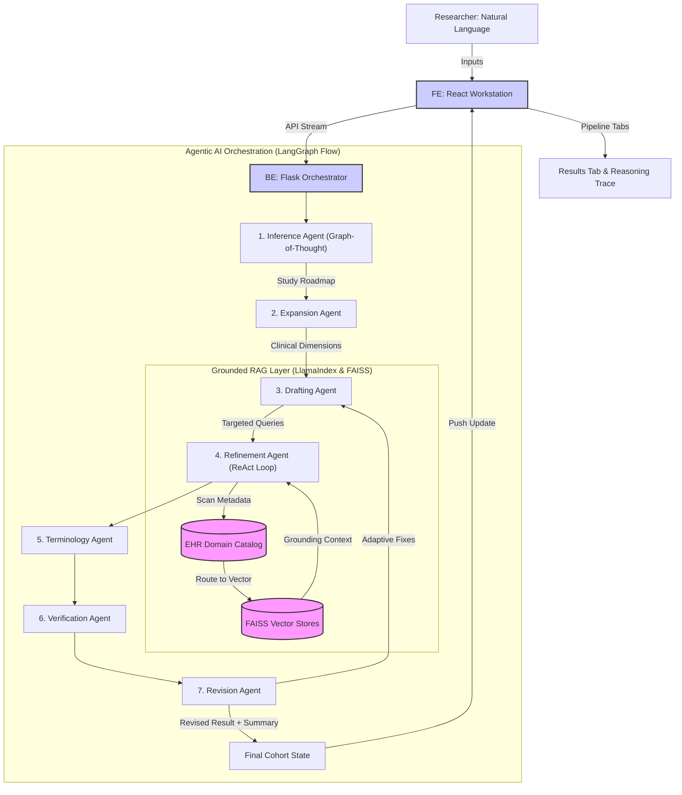

<div align="center">
  <h1>🧬 AI Cohort Definition Refinement Assistant (CORA)</h1>
  <p><strong>Bridging the gap between clinical intent and computable EHR research queries using Agentic AI</strong></p>

  [](https://www.python.org/downloads/)
  [](https://react.dev/)
  [](https://www.langchain.com/langgraph)
  [](https://www.llamaindex.ai/)
  [](#cloud-deployment)
</div>

<br/>

## 🏥 Clinical Significance & Project Description

Defining patient cohorts for clinical research (e.g., for clinical trials, retrospective studies) is a notoriously complex process. Researchers often describe their intended populations in natural language, but translating these descriptions into structured, codifiable criteria (like i2b2 or OMOP) requires deep terminological expertise and an intimate understanding of the underlying Electronic Health Record (EHR) data distributions.

**CORA** solves this by utilizing a state-of-the-art **Multi-Agent orchestration model**. It automatically translates, expands, and iteratively verifies natural language criteria natively against *your specific* EHR population catalog. 

By grounding clinical terminology to standard vocabularies (SNOMED, ICD-10, LOINC, RxNorm, CPT) and fetching real historical EHR metadata to prevent zero-patient "impossible" queries, CORA accelerates study design, mitigates selection cohort bias, and guarantees highly-computable data extraction logic.

---

## 🏗️ System Architecture

The ecosystem relies on **LangGraph** to orchestrate specialized AI agents in a cyclical pipeline, while heavily leaning on **LlamaIndex** to power its Retrieval-Augmented Generation (RAG) grounding layer. Responses stream via Server-Sent Events (SSE) directly to a modern, dynamic React frontend workspace.



### 🧠 The 7 Specialized Agents
The system orchestrates a complex, state-aware flowchart of distinct LLM personas:

1. **Inference Agent (Inference Control)**: Utilizes *Graph-of-Thought (GoT)* reasoning to analyze raw natural language. It determines the core study design, population, constraints, and establishes the high-level roadmap.
2. **Expansion Agent (Domain Targeting)**: Scans the EHR Domain Catalog to identify relevant clinical data silos (e.g., Demographics, Medications, Labs).
3. **Drafting Agent (Structural Blueprinting)**: Translates clinical requirements into formal, structured JSON logic for inclusion, exclusion, and index event criteria.
4. **Refinement Agent (Grounded RAG)**: Features a robust *ReAct (Reason+Act) Loop*. This is the core grounding engine. It queries **LlamaIndex** vector stores against real database descriptors to ensure criteria actually exist in the target database.
5. **Terminology Agent (Vocabulary Mapping)**: Translates natural language disease/drug concepts into robust, standardized database codes (ICD-10, SNOMED CS, RxNorm).
6. **Verification Agent (Compliance Checking)**: Evaluates the structurally-drafted cohort definition against the EHR catalog boundaries. It flags criteria that are "Unsupported" or "Partially Supported" by historical data.
7. **Revision Agent (Adaptive Fixes)**: Dynamically corrects the cohort definition to resolve verification flaws. It automatically widens criteria or suggests alternative data proxies until the cohort is mathematically viable.

---

## 🚀 Quick Start (Local Development)

### Prerequisites
- Python 3.10+
- Node.js 20+
- API keys (Google GenAI or OpenAI)

### 1. Environment Setup
```env
# Create .env in root
GOOGLE_API_KEY=your_google_api_key
OPENAI_API_KEY=your_openai_api_key
```

### 2. Start the Backend
```bash
python3 -m venv .venv
source .venv/bin/activate
pip install -r Backend/requirements.txt

# Start the Flask API and LLM Orchestrator
python3 Backend/app.py
```
*Backend runs on `http://localhost:5001`*

### 3. Start the Frontend
In a new terminal:
```bash
cd Frontend
npm install
npm run dev
```
*Frontend runs on `http://localhost:5173`*

---

## ☁️ Cloud Deployment (Google Cloud Run)

CORA is fully optimized for scalable, stateless deployment on **Google Cloud Run**. Because building large LlamaIndex vector dictionaries requires significant CPU cycles, the architecture bypasses the Docker cold-start penalty by securely mounting a Google Cloud Storage (GCS) bucket directly to the container logic via `gcsfuse`.

For comprehensive, step-by-step deployment instructions, UI configurations, and Secret Manager strategies, see the **[GCP Deployment Guide](GCP_DEPLOYMENT.md)**.

### GCP Console "Cheat Sheet"
Once your code is pushed and you are configuring the Cloud Run service in the GCP Console, you must attach your data bucket using these exact settings to prevent cold-starts:

#### 1. Volumes Tab
- **Add Volume** -> Type: `Cloud Storage bucket`, Name: `clinical-data`, Bucket: `my-clinical-catalog-data`
- **Volume Mounts** -> Volume: `clinical-data`, Mount Path: `/mnt/gcs/clinical-data`

#### 2. Variables Tab
Add these exact Environment Variables to route the app to the bucket:
- `SQLITE_DB_PATH`: `/mnt/gcs/clinical-data/cohort.db`
- `VECTOR_DB_PATH`: `/mnt/gcs/clinical-data/storage`
- `CATALOG_DIR`: `/mnt/gcs/clinical-data`
*(Do not forget to also add your `GOOGLE_API_KEY` or `OPENAI_API_KEY`!)*
